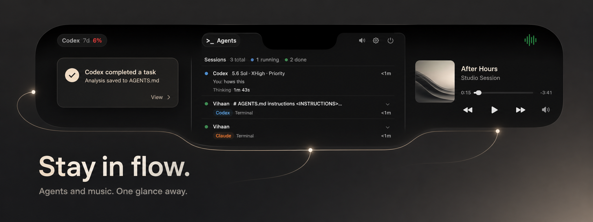

<p align="center">
  
</p>

<h1 align="center">Open Island</h1>

<p align="center">
  <strong>Stay in flow.</strong>
  <br>
  Monitor your coding agents and control your music from one native macOS surface.
  <br><br>
  <strong>Unofficial fork of Open Island</strong> — independently developed and distributed.
  <br><br>
  <a href="README.zh-CN.md">中文</a> | <strong>English</strong>
</p>

> [!IMPORTANT]
> This repository is an independent, **unofficial fork of [Open Island](https://github.com/Octane0411/open-vibe-island)**. It is not maintained, endorsed, supported, or released by the upstream Open Island team. Upstream documentation, support channels, and releases apply to the upstream project only.

<p align="center">
  <a href="https://github.com/VihaanMotwani/open-island-tabs/stargazers"></a>
  <a href="LICENSE"></a>
</p>

<p align="center">
  <a href="#quick-start">Quick Start</a> ·
  <a href="#what-this-fork-adds">What This Fork Adds</a> ·
  <a href="docs/roadmap.md">Roadmap</a> ·
  <a href="#upstream-project-and-attribution">Upstream Project</a>
</p>

---

## What This Fork Adds

- **Agents first** — Monitor Codex, Claude Code, and other supported coding-agent sessions without leaving the task you are already doing
- **Music second** — See Spotify artwork and metadata, scrub progress, and use playback controls inside the expanded notch
- **One compact surface** — Switch between Agents and Spotify without bouncing between app windows
- **Refined expanded UI** — Tighter hierarchy, native-feeling controls, improved contrast, calmer color, and layout fixes for the expanded island

## What is Open Island?

Open Island sits in your Mac's **notch** (or top bar) and gives you a real-time control surface for your AI coding agents — session status, permission approvals, and instant jump-back to the right terminal. This fork also puts Spotify playback and track progress in the same expanded surface, so your agents and music stay one glance away.

Think of it as an open-source [Vibe Island](https://vibeisland.app/) — **free, local-first, and you own every bit of it**.

> *You don't need to pay for a product you can vibe, since you are a vibe coder.*

## Why Open Island?

- **Open source** — GPL v3, fork it, mod it, ship your own version
- **Local-first** — No server, no telemetry, no account. Everything runs on your Mac
- **Native macOS** — SwiftUI + AppKit, not an Electron wrapper
- **Multi-agent** — One surface for Claude Code, Codex, Cursor, Gemini CLI, OpenCode, and more
- **Multi-terminal** — Jump back to the exact terminal/IDE session in one click
- **Music controls** — Spotify now-playing details, progress, and transport controls without opening the Spotify window

## Supported Agents & Terminals

**10 agents**: Claude Code, Codex, Cursor, Gemini CLI, Kimi CLI, OpenCode, Qoder, Qwen Code, Factory, CodeBuddy

**15+ terminals & IDEs**: Terminal.app, Ghostty, iTerm2, WezTerm, Zellij, tmux, cmux, Kaku, VS Code, Cursor, Windsurf, Trae, JetBrains IDEs (IDEA, WebStorm, PyCharm, GoLand, CLion, RubyMine, PhpStorm, Rider, RustRover)

<details>
<summary>Full compatibility table</summary>

### Code Agents

| Agent | Status | Description |
|---|---|---|
| **Claude Code** | Supported | Hook integration, JSONL session discovery, status line bridge, usage tracking |
| **Claude Code (Desktop App)** | Supported | Same hooks as the CLI. Claude Desktop runs Claude Code as a TTY-less subprocess invisible to process discovery, so liveness follows the running desktop app (like Codex.app); jump-back activates Claude. Usage panel is account-wide but seeded by the CLI status line — see note below |
| **Codex** (CLI) | Supported | Hook integration (SessionStart, UserPromptSubmit, Stop by default; PreToolUse/PostToolUse parseable but not default), usage tracking |
| **Codex Desktop App** | Supported | Hook integration + app-server JSON-RPC connection for real-time thread/turn lifecycle. Precise conversation jump via `codex://threads/<id>` deep-link |
| **OpenCode** | Supported | JS plugin integration, permission/question flows, process detection |
| **Qoder** | Supported | Claude Code fork — same hook format, config at `~/.qoder/settings.json` |
| **Qwen Code** | Supported | Claude Code fork — same hook format, config at `~/.qwen/settings.json` |
| **Factory** | Supported | Claude Code fork — same hook format, config at `~/.factory/settings.json` |
| **CodeBuddy** | Supported | Claude Code fork — same hook format, config at `~/.codebuddy/settings.json` |
| **Cursor** | Supported | Hook integration via `~/.cursor/hooks.json`, session tracking, workspace jump-back |
| **Gemini CLI** | Supported | Hook integration via `~/.gemini/settings.json`, session tracking, fire-and-forget events |
| **Kimi CLI** | Supported | Hook integration via `~/.kimi/config.toml` `[[hooks]]`, session tracking, permission flow (reuses Claude payload) |

### Terminals & IDEs

| Terminal / IDE | Support Level | Description |
|---|---|---|
| **Terminal.app** | Full | Jump-back with TTY targeting |
| **Ghostty** | Full | Jump-back with ID matching |
| **cmux** | Full | Jump-back via Unix socket API |
| **Kaku** | Full | Jump-back via CLI pane targeting |
| **WezTerm** | Full | Jump-back via CLI pane targeting |
| **iTerm2** | Full | Jump-back with session ID / TTY matching |
| **tmux** (multiplexer) | Full | Jump-back with session/window/pane targeting |
| **Zellij** | Full | Jump-back via CLI pane/tab targeting |
| **VS Code** | Workspace | Activate workspace via `code` CLI |
| **Cursor** | Workspace | Activate workspace via `cursor` CLI |
| **Windsurf** | Workspace | Activate workspace via `windsurf` CLI |
| **Trae** | Workspace | Activate workspace via `trae` CLI |
| **JetBrains IDEs** | Workspace | IDEA, WebStorm, PyCharm, GoLand, CLion, RubyMine, PhpStorm, Rider, RustRover |
| **Warp** | Full | Precision tab jump via SQLite pane lookup + AX menu click |

### Other Features

| Feature | Description |
|---|---|
| Notch / top-bar overlay | Notch area on notch Macs, top-center bar on others |
| Settings | Hook install/uninstall, usage dashboard |
| Notification mode | Auto-height panel for permission requests and session events |
| Notification sounds | Configurable system sounds, mute toggle |
| i18n | English, Simplified Chinese |
| Session discovery | Auto-discover from local transcripts, persist across launches |
| Auto-update | Sparkle-based automatic updates |
| Signed & notarized | DMG packaging with Apple notarization |

</details>

## Quick Start

This fork currently ships from source. The install script builds the app,
places it at `~/Applications/Open Island Dev.app`, and opens it—no Xcode UI
required:

```bash
git clone https://github.com/VihaanMotwani/open-island-tabs.git
cd open-island-tabs
zsh scripts/launch-dev-app.sh --skip-setup
```

`--skip-setup` keeps the install from changing any agent configuration. On
first launch, open **Settings → Setup** and install hooks only for the agents
you use. If you want the script to install the managed Codex hooks during the
build, run it without `--skip-setup`.

To update later, pull the latest changes and run the same script again. It
rebuilds and replaces the local development app.

<details>
<summary>Run directly from Xcode instead</summary>

```bash
open Package.swift
```

In Xcode, select the **OpenIslandApp** scheme and **My Mac**, then press Run.
The default **OpenIsland-Package** scheme only builds the package; it does not
launch the app.

</details>

> **Requirements**: macOS 14+, Swift 6.2, Xcode

> [!NOTE]
> Downloads and Homebrew packages published by the upstream project are upstream builds; they are not releases of this fork and may not include the Agents/Spotify tab work described here.

## How It Works

```
Agent (Claude Code / Codex / Cursor / ...)
  ↓ hook event
OpenIslandHooks CLI (stdin → Unix socket)
  ↓ JSON envelope
BridgeServer (in-app)
  ↓ state update
Notch overlay UI ← you see it here
  ↓ click
Jump back → correct terminal / IDE
```

Hooks **fail open** — if Open Island isn't running, your agents continue unaffected.

<details>
<summary>Architecture details</summary>

Four targets in one Swift package:

| Target | Role |
|---|---|
| **OpenIslandApp** | SwiftUI + AppKit shell — menu bar, overlay panel, settings |
| **OpenIslandCore** | Shared library — models, bridge transport (Unix socket IPC), hooks, session persistence |
| **OpenIslandHooks** | Lightweight CLI invoked by agent hooks, forwards payloads via Unix socket |
| **OpenIslandSetup** | Installer CLI for managing `~/.codex/config.toml` and hook entries |

See [docs/architecture.md](docs/architecture.md) for the full system design.

</details>

## Fork Development

Issues and pull requests for this fork belong in [VihaanMotwani/open-island-tabs](https://github.com/VihaanMotwani/open-island-tabs). See [CONTRIBUTING.md](CONTRIBUTING.md) before contributing.

## Upstream Project and Attribution

This codebase began as a fork of [Octane0411/open-vibe-island](https://github.com/Octane0411/open-vibe-island) and remains licensed under [GPL v3](LICENSE). Credit for the upstream project belongs to its [original contributors](https://github.com/Octane0411/open-vibe-island/graphs/contributors).

This fork is independently maintained. The upstream maintainers do not endorse, support, release, or accept responsibility for this fork. Use the [upstream repository](https://github.com/Octane0411/open-vibe-island), [upstream releases](https://github.com/Octane0411/open-vibe-island/releases), and upstream community channels only for the upstream project.

## Report a Bug via Your Code Agent

Copy this prompt into your agent (Claude Code, Codex, etc.) to auto-generate a well-structured issue:

<details>
<summary>Click to expand</summary>

```
I'm having an issue with the unofficial Open Island fork at https://github.com/VihaanMotwani/open-island-tabs.

Please help me file a GitHub issue. Do the following:

1. Collect my environment info:
   - Run `sw_vers` to get macOS version
   - Run `swift --version` to get Swift version
   - Check if Open Island is running: `ps aux | grep -i "open.island\|OpenIslandApp" | grep -v grep`
   - Get the app version: `defaults read ~/Applications/Open\ Island\ Dev.app/Contents/Info.plist CFBundleShortVersionString 2>/dev/null || echo "unknown"`
   - Check which terminal I'm using

2. Ask me to describe:
   - What I expected to happen
   - What actually happened
   - Steps to reproduce

3. Create the issue on GitHub using `gh issue create` with this format:
   - Title: concise summary
   - Body with sections: **Environment**, **Description**, **Steps to Reproduce**, **Expected vs Actual Behavior**
   - Add label "bug" if applicable

Repository: VihaanMotwani/open-island-tabs
```

</details>

---

## Agent Parts

This section is written for agents.

The open-source macOS companion for terminal-native AI coding.

`Open Island` puts a lightweight control surface in your notch or top bar so you can keep an eye on live coding agents, follow session progress, and jump back to the right terminal without breaking flow.

### Why This Product Exists

AI coding is becoming part of the daily development loop, but the surrounding control layer still too often means handing your machine over to a closed-source paid app.

`Open Island` takes the opposite approach:

- Open source
- Local first, no server dependency
- Native macOS (SwiftUI + AppKit)
- Built to support the terminal workflow, not replace it

### Who It Is For

Developers who already live in the terminal and want a better way to work with coding agents on macOS without losing context.

### Agent Integrations

- **Codex CLI** — Hook-based integration. The Codex CLI managed installer installs `SessionStart`, `UserPromptSubmit`, and `Stop` by default to keep the terminal workflow low-noise. Open Island can parse richer Codex hook events such as `PreToolUse` and `PostToolUse` when configured manually, but those events are not part of the default managed installation. Codex file edits may use internal apply-patch paths, so file-edit approval should not be treated as guaranteed `PreToolUse` coverage. Reads 5-hour and 7-day account usage windows from local rollout files. Install/uninstall managed hooks from the Settings window or CLI.
- **Codex Desktop App** — Detected via `__CFBundleIdentifier`; hook sessions tagged as `isCodexAppSession` so they follow desktop-app liveness (tied to `NSWorkspace.shared.runningApplications` rather than the CLI subprocess that exits after each turn). In addition to hooks, Open Island launches its own `codex app-server` subprocess and speaks JSON-RPC over stdio to receive live `thread/started`, `turn/started`, `turn/completed`, and `thread/closed` notifications. Clicking a session opens the exact conversation via the `codex://threads/<id>` URL scheme.
- **Claude Code** — Hook-based integration via `~/.claude/settings.json`. Discovers sessions from `~/.claude/projects/` JSONL transcripts. Persists and restores sessions across app launches. Managed status line bridge with opt-in installation. Reads cached 5-hour and 7-day usage windows.
- **Claude Code (Desktop App)** — The Claude desktop app runs Claude Code in its "local agent mode" as a TTY-less subprocess that `ps`/`lsof` process discovery cannot see. Detected via `CLAUDE_CODE_ENTRYPOINT=claude-desktop` (with `__CFBundleIdentifier=com.anthropic.claudefordesktop` as a fallback) and tagged with a `Claude.app` jump target so liveness follows the running desktop app (`NSWorkspace.shared.runningApplications`) instead of the missing terminal process. Without this, the hook-managed liveness fallback evicted the session ~6 seconds after it appeared ([#510](https://github.com/Octane0411/open-vibe-island/issues/510)). Clicking a session activates Claude. **Usage caveat:** the 5h/7d usage panel is fed by Claude Code's terminal status line, which Claude Desktop's headless `stream-json` mode never renders — so Desktop sessions do not update it on their own, and Claude does not persist the rate-limit windows to a readable file. Because the limits are account-wide, running an interactive `claude` in a terminal occasionally seeds the cache and the panel then reflects total usage (including what Desktop consumed). Native Desktop usage (without a CLI session) needs a separate data source and is tracked as a follow-up.
- **OpenCode** — JS plugin integration via `~/.config/opencode/plugins/`. Plugin auto-installed on first launch. Receives session lifecycle, tool use, permission, and question events. Permission approval and question answering flows supported. Process detection via `ps`.
- **Qoder** — Claude Code fork. Same hook format and events via `~/.qoder/settings.json`. Use `--source qoder` with the hooks binary.
- **Qwen Code** — Claude Code fork. Same hook format and events via `~/.qwen/settings.json`. Use `--source qwen` with the hooks binary.
- **Factory** — Claude Code fork. Same hook format and events via `~/.factory/settings.json`. Use `--source factory` with the hooks binary.
- **CodeBuddy** — Claude Code fork. Same hook format and events via `~/.codebuddy/settings.json`. Use `--source codebuddy` with the hooks binary.
- **Cursor** — Hook-based integration via `~/.cursor/hooks.json`. Receives `beforeSubmitPrompt`, `beforeShellExecution`, `beforeMCPExecution`, `beforeReadFile`, `afterFileEdit`, and `stop` events. Session persistence across app launches. Workspace jump-back via `cursor -r`. Use `--source cursor` with the hooks binary.
- **Gemini CLI** — Hook-based integration via `~/.gemini/settings.json`. Receives `SessionStart`, `PreToolUse`, `PostToolUse`, `Stop`, and `UserPromptSubmit` events. Fire-and-forget (no block/deny). Use `--source gemini` with the hooks binary.
- **Kimi CLI** — Hook-based integration via `~/.kimi/config.toml` `[[hooks]]` array (Moonshot AI). Kimi's hook payload is byte-compatible with Claude Code, so Open Island reuses the Claude decode path and adds a dedicated TOML installer. Subscribes to `SessionStart`, `UserPromptSubmit`, `Stop`, `Notification`, `PreToolUse`, and `PostToolUse`. Requires the Kimi CLI Hooks Beta. Use `--source kimi` with the hooks binary. Manage installation from the Settings window, or via CLI:

  ```sh
  swift run OpenIslandSetup installKimi    # write [[hooks]] entries into ~/.kimi/config.toml
  swift run OpenIslandSetup statusKimi     # report whether managed hooks are present
  swift run OpenIslandSetup uninstallKimi  # remove managed entries, preserve user-authored [[hooks]]
  ```

### Terminal Support

- **Terminal.app**, **Ghostty**, **cmux**, **Kaku**, **WezTerm**, **iTerm2**, and **Zellij** — Full jump-back support with session attachment matching (cmux via Unix socket API, Kaku/WezTerm/Zellij via CLI pane targeting, iTerm2 via AppleScript session/TTY probe)
- **VS Code**, **VS Code Insiders**, **Cursor**, **Windsurf**, **Trae** — Workspace-level jump via respective CLI (`code -r`, `cursor -r`, etc.)
- **JetBrains IDEs** (IntelliJ IDEA, WebStorm, PyCharm, GoLand, CLion, RubyMine, PhpStorm, Rider, RustRover) — Workspace-level jump via IDE CLI launcher
- **Warp** — Precision tab jump via SQLite pane lookup, pid-based sibling-tab disambiguation, and AX menu click

### UI & Display

- **Notch overlay** — On Macs with a built-in notch, the island sits in the notch area; on external displays or non-notch Macs, it falls back to a compact top-center bar
- **Settings** — Hook install/uninstall, Codex/Claude usage dashboard, General, Display, Sound, Shortcuts, Lab (advanced), About
- **Notification mode** — Auto-height notification panel for permission requests and session events
- **Notification sounds** — Configurable system sounds (default: Bottle) with mute toggle
- **i18n** — English and Simplified Chinese

### Session Management

- Live session visibility with expandable detail rows
- Session state reducer (`SessionState.apply`) as single source of truth
- Automatic session discovery from local transcript files and cache
- Process discovery via `ps`/`lsof` for active agent matching

### Architecture

Four targets in one Swift package:

| Target | Role |
|---|---|
| **OpenIslandApp** | SwiftUI + AppKit shell — menu bar, overlay panel, settings |
| **OpenIslandCore** | Shared library — models, bridge transport (Unix socket IPC), hooks, session persistence |
| **OpenIslandHooks** | Lightweight CLI invoked by agent hooks, forwards payloads via Unix socket |
| **OpenIslandSetup** | Installer CLI for managing `~/.codex/config.toml` and hook entries |

### Quick Start (Agent)

Build, install, and run the local development app without changing agent
configuration:

```bash
zsh scripts/launch-dev-app.sh --skip-setup
```

The script replaces `~/Applications/Open Island Dev.app` and launches it. For
a direct Xcode run, open `Package.swift`, select the **OpenIslandApp** scheme
and **My Mac**, then press Run.

Build a local `.app` bundle:

```bash
zsh scripts/package-app.sh
```

That script creates `output/package/Open Island.app` and `output/package/Open Island.zip`. Pass `OPEN_ISLAND_SIGN_IDENTITY` to sign the bundle. See [docs/packaging.md](docs/packaging.md) for the full path, including notarization.

#### Connect Codex

Launch the app with `scripts/launch-dev-app.sh` or the **OpenIslandApp** Xcode
scheme. On launch, the app restores its local cache, scans recent
`~/.codex/sessions/**/rollout-*.jsonl` files for existing Codex sessions, and
starts the live bridge for new hook events.

The Settings window shows live Codex hook install status from `~/.codex`, and can install or uninstall managed hook entries directly. Installs copy the helper into `~/Library/Application Support/OpenIsland/bin/OpenIslandHooks` so repo renames do not break existing hooks.

```bash
swift build -c release --product OpenIslandHooks
swift run OpenIslandSetup install
swift run OpenIslandSetup status
swift run OpenIslandSetup uninstall
```

#### Connect Claude Code

Claude usage setup is available from the app's Settings window and remains opt-in. The bridge writes a managed `statusLine.command` to `~/.open-island/bin/open-island-statusline`, caches `rate_limits` into `/tmp/open-island-rl.json`, and refuses to overwrite an existing custom status line automatically.

### Repository Map

- Start with [docs/index.md](docs/index.md) for the current doc map.
- Read [docs/quality.md](docs/quality.md) for the quality baseline and verification approach.
- Read [docs/hooks.md](docs/hooks.md) for all supported hook events, payload fields, and directive response formats.
- Run `scripts/harness.sh` for automated checks (docs validation, tests, build).

### Requirements

- macOS 14+
- Swift 6.2
- Xcode (for the app target)

---

## License

[GPL v3](LICENSE)
